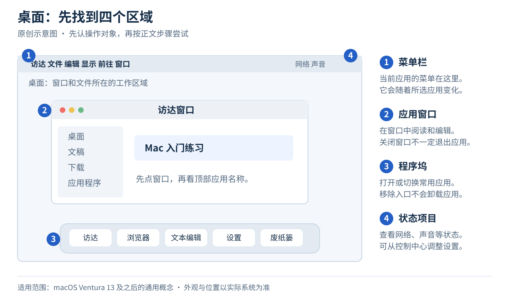

# 02 · 桌面、菜单栏与应用

[上一章](01-first-steps.md) · [返回目录](../README.md) · [下一章：键盘、触控板与中文输入](03-keyboard-and-trackpad.md)

**本章目标：** 能找到应用入口，知道正在操作哪个应用，并正确关闭或退出它。

## 1. 屏幕上最重要的几个地方

| 位置 | 名称 | 用途 |
| --- | --- | --- |
| 屏幕中间的工作区域 | 桌面 | 显示窗口，也可以放文件和文件夹 |
| 屏幕顶端 | 菜单栏 | 显示当前应用的“文件”“编辑”等菜单 |
| 通常在屏幕底部的一排图标 | 程序坞（Dock） | 打开或切换常用应用，访问废纸篓等项目 |
| 菜单栏右侧 | 状态项目与控制中心 | 查看或调整网络、声音等状态 |
| 程序坞里的蓝色笑脸 | 访达（Finder） | 浏览文件、文件夹和磁盘 |

程序坞和菜单栏可以自动隐藏。把指针移到相应的屏幕边缘，它们通常就会出现。这些区域的含义可参考 [Apple 桌面入门说明](https://support.apple.com/zh-cn/guide/mac-help/mchlws12345m2/mac)。

这张原创示意图帮助你认位置，说明 macOS Ventura 13 及之后的通用概念。实际外观与布局以自己的电脑为准，见[配图说明](../assets/README.md)。

## 2. 最省事的应用入口：聚焦

“聚焦”（Spotlight）是系统搜索工具。

1. 按 `⌘ 空格`，或者点按菜单栏里的放大镜。
2. 输入 `Safari`。先用这个英文名称练习，中文输入将在下一章设置。
3. 找到带指南针图标的 Safari 应用结果，点按它或选中后按 Return。
4. 确认浏览器窗口已经打开。

设置中文输入后，想打开“文本编辑”“备忘录”“系统设置”，也可以这样搜索。搜索同名内容时要认清结果类型，文件、网页和应用可能同时出现。

如果 `⌘ 空格` 被输入法或其他工具占用，先用菜单栏放大镜，再按[键盘章节](03-keyboard-and-trackpad.md)检查快捷键设置。

## 3. 菜单跟着当前应用走

点按 Safari 窗口后，屏幕顶端会显示 Safari 的名称和菜单。再点程序坞中的访达图标，菜单就会变成访达的菜单。

因此教程说“选择 文件 → 新建”，通常指的是**屏幕顶端当前应用的菜单**，而不是窗口里面一个固定的按钮。找不到所说的菜单时，先点按目标应用的窗口，再看菜单栏最左边显示的应用名称。

## 4. 关闭窗口与退出应用

许多窗口左上角有三个圆形按钮：

| 按钮 | 一般行为 |
| --- | --- |
| 红色 | 关闭这个窗口 |
| 黄色 | 把这个窗口最小化 |
| 绿色 | 进入全屏，或提供窗口布局选项 |

**关闭窗口不一定会退出应用。** 有些应用会在最后一个窗口关闭后退出，有些会继续运行。需要退出指定应用时，先点它的程序坞图标，让屏幕顶端显示它的名称，再选择退出菜单。例如退出文本编辑时，选择 `文本编辑 → 退出文本编辑`，或按 `⌘ Q`。这两种操作退出的都是当前应用。

程序坞中应用图标下方的小点通常表示它还在运行，但这个指示可以在设置中关闭。判断某个应用是否退出，优先看它是否还出现在 `⌘ Tab` 的应用切换列表里。[Apple 窗口说明](https://support.apple.com/zh-cn/guide/mac-help/mchlp2469/mac)

## 5. 让常用应用留在程序坞

应用运行时，在程序坞里的图标上右键点按，选择 `选项 → 在程序坞中保留`。右键操作可以用触控板双指点按，也可以按住 Control 再点按。

如果想取消固定这个入口，打开同一菜单并取消“在程序坞中保留”。应用正在运行时，图标仍可显示在程序坞中。**取消保留不会卸载应用。** 要查找已安装的应用，打开访达的“应用程序”文件夹。需要卸载时看[第五章](05-install-and-remove-apps.md)。

## 小练习：完整使用一次应用

1. 点程序坞中的访达图标，选择菜单栏的 `前往 → 应用程序`，找到“文本编辑”，连按两下打开。这个方法不需要先会输入中文。
2. 如出现文件选择窗口，点“新建文稿”，或选择 `文件 → 新建`。
3. 输入 `Hello, Mac.`。输入中文的练习在下一章。
4. 关闭窗口。如果系统询问是否存储，这一次可以选择“不存储”，因为它是测试内容。
5. 检查文本编辑是否仍在运行。若仍在运行，点它的程序坞图标，再选择 `文本编辑 → 退出文本编辑`。若已经退出，本次练习就已完成。

**完成标准：** 你可以指出菜单栏、程序坞和访达，并能解释“窗口”和“应用”的区别。

---

[上一章](01-first-steps.md) · [返回目录](../README.md) · [下一章：键盘、触控板与中文输入](03-keyboard-and-trackpad.md)
