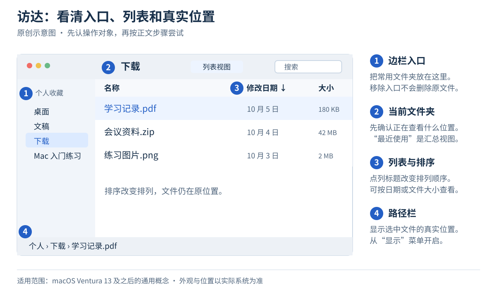
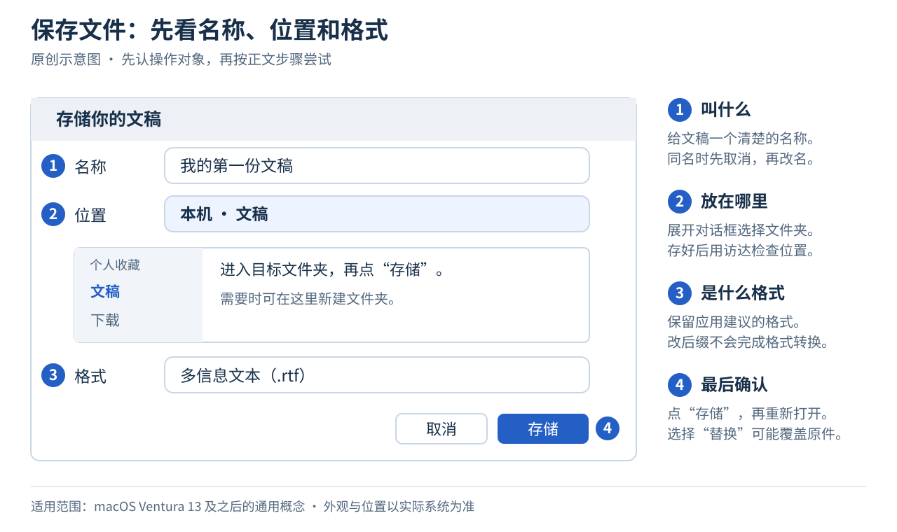

# 04 · 访达与文件

[上一章](03-keyboard-and-trackpad.md) · [返回目录](../README.md) · [下一章：安装与卸载应用](05-install-and-remove-apps.md)

**本章目标：** 能保存并找到文稿，保留原稿，整理文件列表，完成复制、移动和恢复。

## 1. 文件是什么，访达是什么

文稿、照片和 PDF 都是文件，文件夹用来容纳文件和其他文件夹。“访达”（Finder）是浏览和管理它们的系统应用。点按程序坞里的蓝色笑脸图标即可打开。

窗口边栏常见的入口包括：

| 入口 | 通常放什么 |
| --- | --- |
| 桌面 | 显示在桌面上的文件 |
| 文稿 | 你长期保存的文稿和项目资料 |
| 下载 | 浏览器下载的文件，除非你另改了保存位置 |
| 应用程序 | 安装在这里的应用 |
| iCloud 云盘（启用时） | 参与 iCloud 同步的文件，本教程默认不用 |
| 最近使用 | 最近访问项目的汇总视图，不是独立的储存文件夹 |

“最近使用”中的文件仍然位于原来的位置。**在这个视图里删除文件，会删除实际文件。** 如果某个入口没出现，可以在访达的“前往”菜单中查找，或者调整 `访达 → 设置 → 边栏`。[Apple 访达说明](https://support.apple.com/zh-cn/guide/mac-help/mchlp2605/mac)

选择菜单栏的 `前往 → 个人`，或在访达按 `⇧ ⌘ H`，可以打开自己的用户文件夹。它通常以账户的短名称命名，里面有“下载”“图片”等文件夹。这里的“个人”是一个文件夹入口，与 Apple 账户设置是两回事。[Apple 文件夹快捷键](https://support.apple.com/zh-cn/102650)

图为原创结构示意，说明 macOS Ventura 13 及之后的常见功能。按钮外观与位置可能随版本变化，素材说明见[配图说明](../assets/README.md)。

## 2. 创建并保存第一份文稿

新建文稿要先打开能编辑它的应用，再把内容存成文件。访达里的“新建文件夹”负责建立容纳文件的位置。

1. 用聚焦打开“文本编辑”，选择 `文件 → 新建`。
2. 输入“今天我学会了保存文件”。
3. 按 `⌘ S`，或者选择 `文件 → 存储`。
4. 将名称设为“我的第一份文稿”，保留应用建议的文件格式。
5. 在存储对话框里选择“文稿”文件夹。如果对话框太简略，点名称或位置旁边的展开按钮显示更多位置。
6. 完成存储，关闭文稿窗口。
7. 回到访达，打开“文稿”，连按刚才的文件，确认内容仍在。

存储前检查三件事：**叫什么、放哪里、是什么格式**。展开对话框后，可以用边栏进入位置，再连按里面的文件夹进入下一层。要放进某个文件夹，先进入它，再点“存储”，不要只在文件夹名字上点一下。

对话框中的“新建文件夹”可以直接建立保存位置。存好后，用访达和路径栏确认实际位置。如果提示同名文件已经存在，先取消，改一个不同名称再存。选择“替换”可能覆盖已有文件，不是给它多加一个副本。[Apple 文稿保存说明](https://support.apple.com/zh-cn/guide/mac-help/mchldc1dd114/mac)

不要只记文件名，也要记保存位置。文稿默认带的 `.rtf` 或 `.txt` 等后缀表示文件格式，不需要为了“好看”而删掉。

把 `.rtf` 改名为 `.pdf` 不会完成格式转换。需要 PDF 时，按[第七章的打印步骤](07-everyday-work.md)生成，再打开检查内容。

本教程默认把文稿保存在本机，不需要为这一步登录 Apple 账户或启用 iCloud。若你此前已启用桌面与文稿同步，这两个位置也可能参与同步。本章的测试文稿可以继续使用。真实重要文件的同步和备份安排见[第九章](09-backup-and-icloud.md)。

## 3. 给它建立一个家

在访达“文稿”中选择 `文件 → 新建文件夹`，或按 `⇧ ⌘ N`，将文件夹命名为“Mac 入门练习”。再在里面建立“草稿”和“成品”两个子文件夹。

选中文件后按 Return，可以编辑文件名，完成后再按 Return 确认。**Return 在这里用于重命名，打开文件可用连按两下或 `⌘ O`。**

## 4. 存储、另存、复制与导出

| 操作 | 你通常得到什么 | 要留意什么 |
| --- | --- | --- |
| 存储 / 保存 | 把修改写入当前文稿 | 再次存储通常会更新原文件 |
| 存储为 / 保存为 | 使用另一个名称、位置或格式保存 | 留意完成后正在编辑的是哪一份 |
| 应用中的“复制” | 从当前文稿创建另一份，随后为它命名并存储 | 不同应用的菜单与行为可能不同 |
| 导出或打印成 PDF | 用于交付的另一种格式 | 保留能继续编辑的原稿，检查输出结果 |

想保留原稿，先保存当前文稿，再制作副本。以文本编辑为例，选 `文件 → 复制`，在新文稿中按 `⌘ S`，设置不同名称和本地练习文件夹，存好后再修改副本。如果应用没有“复制”，查找“存储为 / 保存为”，有些应用需按住 Option 再打开“文件”菜单才显示。也可以关闭已保存的文稿，按下一节的方法在访达中复制。[Apple 创建和处理文稿说明](https://support.apple.com/zh-cn/guide/mac-help/mchldc1dd114/mac)

复制后检查窗口标题和保存位置，别在打开了多份文稿时改错原件。给原文稿重命名，通常不会额外保留旧名称的那一份。

## 5. 先选中，再复制或移动

点按文件一次是选中，连按两下才是打开。选中后的操作会作用于这些文件，批量删除或移动前先检查选中了什么。

| 想选什么 | 方法 |
| --- | --- |
| 一份文件 | 点按一次 |
| 不相邻的几份文件 | 按住 Command，逐个点按。再点已选中的项目可取消选择 |
| 列表中相邻的一段 | 点第一份，按住 Shift 再点最后一份 |
| 当前文件列表里的全部项目 | 先点按这个列表，再按 `⌘ A` |

这些方法也常用于其他应用的列表，但要以当前界面的行为为准。[Apple 选择项目说明](https://support.apple.com/zh-cn/guide/mac-help/mchlp1378/mac)

选好文件后，再决定是复制还是移动：

| 目标 | 步骤 | 最后会怎样 |
| --- | --- | --- |
| 复制一份 | 选中文件后按 `⌘ C`，进入目标文件夹后按 `⌘ V` | 原位置和目标位置都保留一份 |
| 移动文件 | 选中文件后按 `⌘ C`，进入目标文件夹后按 `⌥ ⌘ V` | 文件从原位置移到目标位置 |

访达的文件移动通常不使用“先 `⌘ X` 再 `⌘ V`”这套文本剪切操作。上表说的是**访达中的文件**，不是文稿里选中的文字。[Apple 文件操作快捷键](https://support.apple.com/zh-cn/102650)

拖移也能搬文件，但跨磁盘与同一磁盘里的默认行为可能不同。新手先用上面两组操作，完成后查看原位置和目标位置，确认实际结果。

## 6. 先预览，再决定打开

选中图片、PDF 等支持预览的文件，按空格可快速查看，再按空格关闭。如果预览不支持该格式，再用合适的应用打开。[Apple 文件预览说明](https://support.apple.com/zh-cn/guide/mac-help/mchlgtd_prev01/mac)

要确认文件在哪个文件夹，可以在访达选择 `显示 → 显示路径栏`。选中文件后，窗口底部会显示所在路径。

## 7. 用列表与边栏整理文件

文件变多时，先把显示方式调到方便查找的状态：

1. 在访达打开“下载”，选择 `显示 → 为列表`，或按 `⌘ 2`。
2. 点“修改日期”等列标题排序，再点一次可以反转顺序。想找最新下载的文件时，也可查看“添加日期”，这与文件内容最后修改的时间不同。
3. 想看文件大小时，查看“大小”列。缺少某列时，在列标题上右键点按，选择需要显示的列。文件夹的大小可能暂时不显示，先比较普通文件即可。
4. 用空格预览结果，确认找对了文件。排序只改变排列，不会搬动文件。

图标视图适合看缩略图，分栏视图适合逐层进入文件夹，画廊视图适合浏览大图预览。工具栏或“显示”菜单可以切换，先会用列表视图就够了。[Apple 视图与排序说明](https://support.apple.com/zh-cn/guide/mac-help/mchlp1745/mac)

想少走几层文件夹，可以把“Mac 入门练习”拖到访达边栏的“个人收藏”区域。以后点这个入口就能进入原文件夹。将它右键“从边栏移除”，只是移除入口，文件夹仍在原位置。[Apple 边栏说明](https://support.apple.com/zh-cn/guide/mac-help/mchl83c9e8b8/mac)

如果想更容易辨认 `.rtf`、`.pdf` 等格式，可在 `访达 → 设置 → 高级` 启用“显示所有文件扩展名”。显示扩展名不会转换文件格式，重命名时仍要保留正确后缀。[Apple 访达设置](https://support.apple.com/zh-cn/guide/mac-help/mchlp2803/mac)

## 8. 搜索时看清范围

1. 在访达打开“Mac 入门练习”，按 `⌘ F`，或点窗口工具栏的搜索按钮。
2. 输入文件名的一部分，例如“第一份”。如果出现按名称查找的建议，可以选择它。
3. 查看搜索框下方的范围，选择当前文件夹名称或“这台 Mac”。只在当前文件夹里搜索，就找不到其他位置的文件。
4. 选中结果，在路径栏确认真实位置，再打开它。搜索结果中的文件仍是原文件，删除或移动会影响它。

在 `访达 → 设置 → 高级` 中可以查看默认搜索范围。记不住位置时，也可以用聚焦搜索文件名，或从应用的“文件”菜单查看最近使用的文稿。[Apple 访达设置](https://support.apple.com/zh-cn/guide/mac-help/mchlp2803/mac)、[找不到文件时的检查方法](https://support.apple.com/zh-cn/guide/mac-help/mchlp2305/mac)

## 9. 删除与恢复

对测试文件右键点按，选“移到废纸篓”，或选中文件后按 `⌘ Delete`。在废纸篓内找到它，右键选择“放回原处”，可以恢复到原来的位置。

清倒废纸篓会进一步删除其中的文件。本章练习**不需要清倒废纸篓**。如果文件在 iCloud 云盘或共享文件夹中，删除还可能影响其他设备或参与者，操作前先看[同步说明](09-backup-and-icloud.md)。

## 10. 查看文稿的旧版本

部分应用会保留文稿版本。以支持这项功能的文本编辑文稿为例，打开 `文件 → 复原到 → 浏览所有版本`，可以查看以前的内容。菜单名称也可能含“恢复”。

想保留当前文件并取出旧内容时，在旧版本画面中按住 Option，查看“恢复副本”选项。直接选择“恢复”会让当前文稿回到所选版本，操作前先确认自己想保留哪一份。[Apple 文稿版本说明](https://support.apple.com/zh-cn/guide/mac-help/mh40710/mac)

只用测试文稿练习：先写“版本 A”并存储，再改成“版本 B”并存储，查看版本列表能否找到 A。找不到旧版本时不要强行恢复，继续保留测试文件。并非所有应用、文件或位置都支持相同的版本功能。

文稿版本不是独立备份，也不能保证文件被删除或磁盘损坏后仍能找回。重要文件仍按[第九章](09-backup-and-icloud.md)备份。

## 11. 使用 U 盘或外置磁盘

插入磁盘后，在访达边栏的“位置”区域查找设备。拷贝文件时等进度结束，并打开目标副本检查内容。

用完后，点设备旁边的推出按钮，或选中设备按 `⌘ E`。等它从访达中消失，再拔掉连接。如果提示正在使用，先关闭相关文件和应用，再尝试推出。

看不见设备时，先检查连接线和配件允许提示，见[配件连接说明](accessories-and-printing.md)。磁盘能读却不能写时，见[第十章](10-troubleshooting.md)。

## 小练习：确认你搬对了

1. 把“我的第一份文稿”移动到“Mac 入门练习/草稿”。
2. 复制一份到“成品”，将副本重命名为“已完成的练习”。
3. 打开副本，确认内容正确。
4. 将副本移到废纸篓，再放回原处。
5. 在“Mac 入门练习”中搜索“已完成”，检查范围和路径，找到恢复后的副本。
6. 回到“Mac 入门练习”的普通文件列表，按住 Command 点按“草稿”和“成品”，确认两者都被选中。按住 Command 再点其中一个，取消选择它。
7. 把“Mac 入门练习”放到边栏，再通过这个入口打开它。切到列表视图，尝试按名称或修改日期排序，确认文件仍在原位置。

想继续练习，可以在文本编辑中打开“已完成的练习”，用“文件 → 复制”存成“另一份练习”，只修改这份新文稿。重新打开原件，确认它没有跟着改变，再用测试文稿尝试旧版本功能。

**完成标准：** “草稿”中保留原件，“成品”中有独立副本。你能找到副本、确认位置、选中多个项目，并用列表和边栏导航。你知道两份独立文稿不会自动互相更新，也知道保存修改可能改变当前原件。
