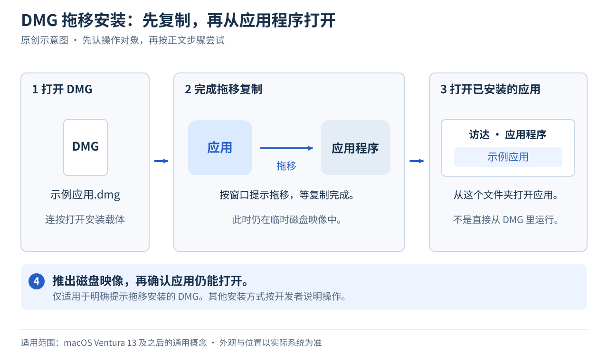

# 05 · 安装与卸载应用

[上一章](04-finder-and-files.md) · [返回目录](../README.md) · [下一章：窗口与多任务](06-windows-and-multitasking.md)

**本章目标：** 认出常见安装方式，能找到已安装的应用并正确卸载。

## 1. 下载不等于安装

“下载”是把文件从网上保存到电脑。“安装”是按软件要求把它放到合适位置或完成安装程序。先看你下载的是什么，再决定下一步。

| 你拿到的东西 | 常见处理方式 |
| --- | --- |
| App Store 的“获取”或价格按钮 | 需要 Apple 账户，在商店里按提示登录、下载和安装 |
| `.dmg` | 打开磁盘映像，按里面的说明拖移应用或运行安装器 |
| `.pkg` | 打开安装软件包，按安装器步骤进行 |
| `.zip` | 连按两下解压，再查看里面的应用、安装器或说明 |
| `.exe` / `.msi` | 通常是 Windows 安装文件，不能作为普通 Mac 应用直接安装 |

Mac 自带 ZIP 解压功能，解压结果通常出现在同一个文件夹里，不必为了本教程先安装解压软件。[Apple ZIP 说明](https://support.apple.com/zh-cn/guide/mac-help/mchlp2528/mac)

## 2. 从哪里获取

本教程优先使用自带应用。确实需要其他软件时，先看开发者官方网站是否提供 Mac 版本。只在所需软件需要通过 App Store 获取时，再考虑登录商店。官网提供的安装文件按后面的步骤处理，无需为了普通的本地安装，额外在系统设置登录 Apple 账户。软件自身的购买或授权要求另看开发者说明。

不要只看下载按钮的颜色。搜索广告、仿冒页面和下载站可能让你拿到别的软件。仍要核对开发者、文件来源和系统安全提示。

需要 App Store 时，打开商店，点窗口左下角的“登录”，按提示操作。仅有商店需求时，就从这个入口开始，不必额外到系统设置登录 iCloud。以后更新或重新下载可能仍需要用于获取应用的账户，记好它。需要退出商店时，选择 `商店 → 退出登录`。[Apple App Store 登录说明](https://support.apple.com/zh-cn/guide/app-store/fir6253293d/mac)

如果官网下载页区分“Apple 芯片 / Apple silicon”和“Intel”，用 ` → 关于本机` 对照。标有“通用 / Universal”的 Mac 版本通常同时支持这两类处理器。系统版本要求也要一起看。

在搭载 Apple 芯片的 Mac 上，部分旧款 Intel **Mac 应用**可能提示安装 Rosetta。先找开发者是否提供 Apple 芯片或通用版本。确实需要兼容旧应用、当前系统仍支持时，可以按系统提示安装 Rosetta，它随后在后台工作。Rosetta 不会把 Windows 的 `.exe` 变成 Mac 应用，也不能保证所有旧软件在未来系统中继续运行。[Apple Rosetta 说明](https://support.apple.com/zh-cn/102527)

本教程的练习用自带应用就能完成，不需要购买额外软件。安装第三方应用时，只选你确实需要的。

## 3. 常见 DMG 安装过程

这是适用于明确提示拖移安装的 DMG 的原创流程示意，macOS Ventura 13 及之后的常见做法可参照。窗口里的图标和提示由开发者决定，不是每个 DMG 都采用这种方式。

1. 到“下载”文件夹，连按 `.dmg` 文件。
2. 系统打开一个像磁盘一样的临时位置，里面可能有应用图标和“应用程序”文件夹入口。
3. 如果窗口明确提示拖移安装，将应用图标拖到“应用程序”入口。其他类型按开发者的说明操作。
4. 等复制完成，从访达的“应用程序”文件夹打开应用。
5. 在访达边栏找到刚挂载的磁盘映像，点旁边的推出按钮。
6. 确认应用安装成功后，不需要保留的安装文件可以移到废纸篓。

从 DMG 里直接运行应用，不代表你已把它安装到“应用程序”。推出磁盘映像后仍能从“应用程序”打开，才完成了这种拖移安装方式。[Apple 安装说明](https://support.apple.com/zh-cn/guide/mac-help/mh35835/mac)

## 4. PKG、权限和安全提示

PKG 会运行安装器，可能要求本机管理员验证，也可能安装后台组件。先确认开发者、下载来源和软件用途，再按屏幕提示操作。

第一次启动时，应用可能申请相机、麦克风、文件等权限。根据你正在使用的功能决定是否允许，之后也可以在系统设置调整。

安全提示要读完整文字，不同提示的处理方式不同：

| 提示的大意 | 下一步 |
| --- | --- |
| 应用是从互联网下载的，询问是否打开 | 首次启动时可能出现。核对应用名称和下载来源，确认是自己获取的软件后再决定打开 |
| 无法验证开发者，或 Apple 无法检查是否含恶意软件 | 优先找官方更新版本或联系开发者。只有充分确认来源可信、文件未遭篡改时，才考虑按 Apple 的单个应用例外步骤打开 |
| 设置只允许 App Store 应用 | 查看当前“隐私与安全性”设置，按 Apple 说明确认是否需要允许被认可的开发者。公司设备可能由管理员限制 |
| 应用会损坏电脑，或应用已损坏 | 停止打开。前者可能涉及恶意内容或授权撤销，后者也可能是损坏或篡改。移除这份下载，向开发者或管理员核实 |

Apple 对符合条件的单个应用例外提供了 `系统设置 → 隐私与安全性 → 仍要打开` 的操作说明。**这个按钮不是上述所有提示的通用处理办法。** 不确定来源和文件完整性时，先寻求开发者支持。[Apple 安全打开应用说明](https://support.apple.com/zh-cn/102445)

不要把关闭系统保护或运行不明命令当成通用修复办法。

## 5. 卸载与更新

卸载前先退出应用。

1. 查看开发者是否提供卸载程序，特别是带驱动或后台组件的软件。
2. 若提供，按官方卸载步骤操作。
3. 对没有卸载程序的普通应用，在访达“应用程序”中将它移到废纸篓。

部分系统自带应用不能这样删除。卸载应用通常也不会删除你创建的文稿。**卸载不会自动取消订阅**，订阅需要在对应账户或服务里管理。[Apple 卸载说明](https://support.apple.com/zh-cn/102610)

App Store 应用在商店的更新页面查看更新。官网下载的应用一般在自己的菜单里提供“检查更新”，或由开发者另行说明。

## 小练习：看懂安装文件

不必真的下载软件。打开访达的“应用程序”，找到一个自带应用，用聚焦再次找到并打开它。然后根据上面的表格回答：

- `.dmg` 和已经放进“应用程序”的应用，哪一个是安装载体？
- 移除程序坞图标是否等于卸载？
- 发现订阅应用不再需要时，除了卸载还要做什么？

**参考答案：** DMG 是安装载体。程序坞只是入口。订阅要另行取消。
